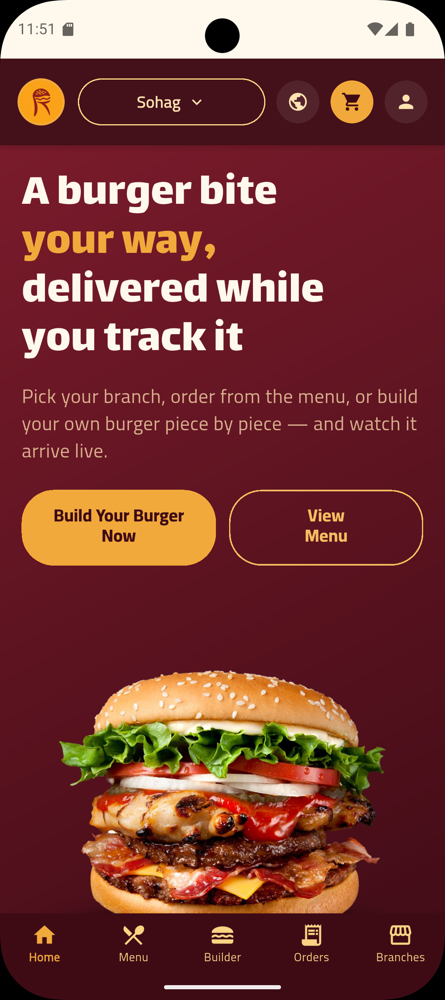
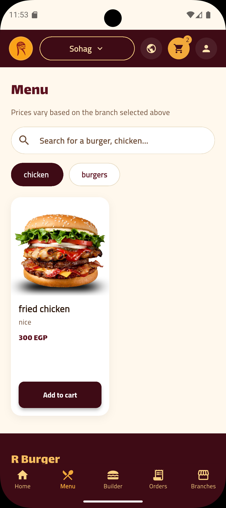
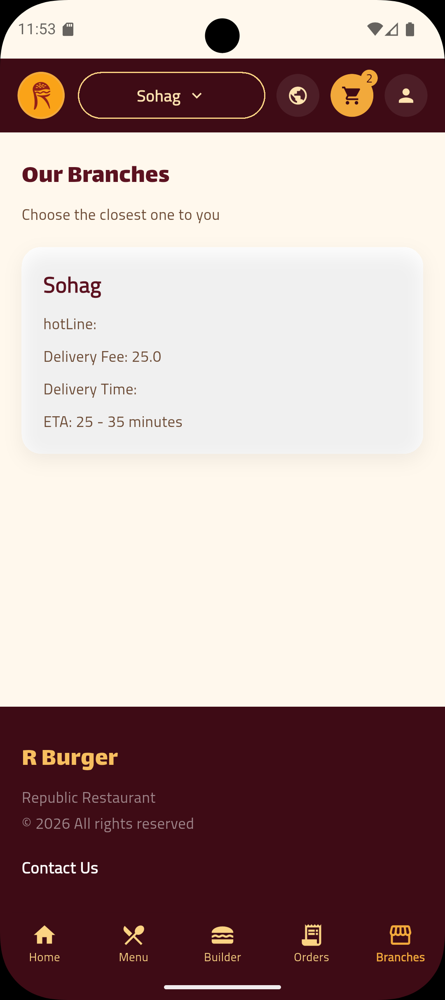
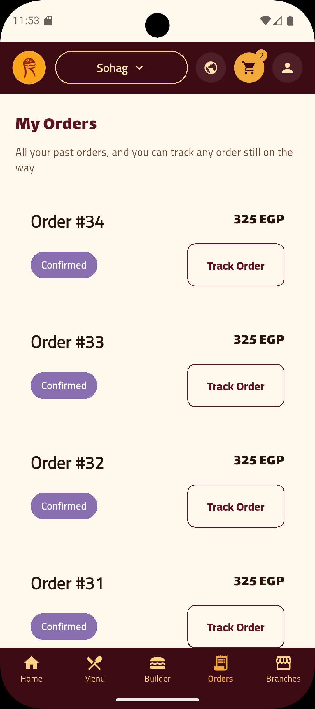
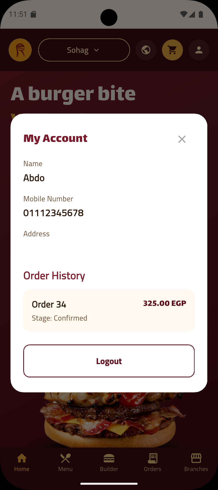
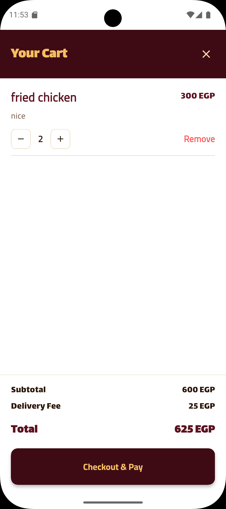
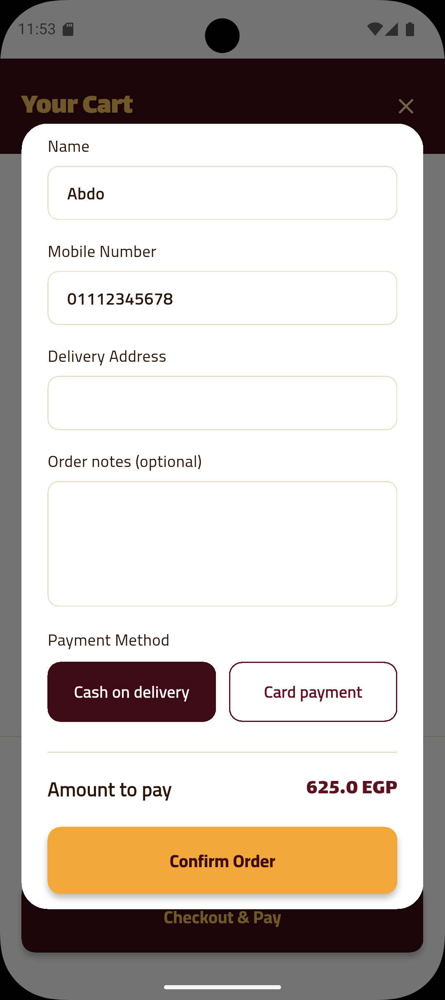

# 🍔 R Burger — Food Ordering App

A modern Flutter food ordering mobile app built around a real REST API, with customer ordering, custom burger building, online payments, order tracking, branch selection, and a dedicated driver workflow.

R Burger was built as a practical Flutter project focused on integrating a polished mobile UI with real backend services and production-style application flows.

## ✨ Features

### 👤 Authentication & Account

- Customer registration and login
- Secure authentication token storage
- Account/profile information
- Logout
- Customer order history

### 🍔 Food Ordering

- Browse the restaurant menu
- Search menu items
- Category filtering
- Product details
- Add/remove items from the cart
- Quantity controls
- Persistent local cart
- Order notes and delivery information

### 🧑‍🍳 Burger Builder

- Build a custom burger from available ingredients
- Choose bun, patty, cheese, sauces, and toppings
- Live total-price calculation
- Add the customized burger directly to the cart

### 📍 Branches & Delivery

- Select a restaurant branch
- Display branch information
- Branch-aware ordering flow
- Delivery address and contact information

### 💳 Checkout & Payments

- Cash on delivery
- Card payment through Paymob
- Paymob 3D Secure authentication flow
- Backend payment confirmation
- Payment status verification before confirming the order

### 📦 Orders & Tracking

- View previous orders
- Order status/stage display
- Track active orders
- Order confirmation
- Order rating flow
- Real-time order updates using SignalR

### 🚗 Driver Workflow

- Driver authentication
- Driver order list
- New, ongoing, and completed orders
- Order status updates
- Driver-specific UI and order cards

### 🌐 Localization

- English and Arabic
- Runtime language switching
- Localization with easy_localization
- Localized customer-facing UI and order/payment messages

### 🎨 UI & UX

- Custom restaurant-themed design system
- Reusable widgets and components
- Custom typography with Google Fonts
- Responsive dialogs and checkout flows
- Animated/interactive burger-building experience

## 🛠️ Tech Stack

| Technology | Usage |
|---|---|
| Flutter / Dart | Mobile application |
| Dio | REST API communication |
| flutter_bloc / Cubit | State management |
| go_router | Application navigation |
| easy_localization | English/Arabic localization |
| flutter_secure_storage | Secure token storage |
| shared_preferences | Local preferences/state |
| Paymob SDK | Card payments |
| SignalR | Real-time order updates |
| webview_flutter | Web-based payment flow support |
| google_fonts | Application typography |
| cached_network_image | Network image loading/caching |
| flutter_dotenv | Environment configuration |

## 🏗️ Architecture & Project Structure

The project separates screens, reusable UI, services, models, and state management.

```text
lib/
├── burger model/          # Burger builder models and UI
├── cubit/                 # Cubit/state-management logic
├── driver folder/         # Driver-specific UI and controllers
├── login folder/          # Authentication and account UI
├── models/                # Application models
├── screens/               # Main application screens
├── services/
│   ├── data/              # Local/static application data
│   ├── driver_orders_service/  # Driver order API logic
│   ├── login_service/     # Customer/driver authentication
│   ├── orders/            # Order creation and retrieval
│   ├── profile_service/   # Profile-related API logic
│   └── signalR_service/   # Real-time communication
├── widgets/               # Reusable UI components
├── app_theme.dart         # Application theme/design system
├── routing.dart           # App routing
└── main.dart              # Application entry point
```

## 📱 Screenshots

### Home & Menu

| Home | Menu | Branches |
|---|---|---|
|  |  |  |

### Orders & Account

| Orders | Profile |
|---|---|
|  |  |

### Cart & Checkout

| Cart | Checkout |
|---|---|
|  |  |

### Burger Builder

| Custom Burger Builder |
|---|
|  |

### Driver Orders

| New Orders | Ongoing Orders | Completed Orders |
|---|---|---|
|  |  |  |

## 🔌 Backend Integration

The Flutter application communicates with a separate backend API for application data and business operations.

The mobile client integrates with backend services for:

- Authentication
- Menu/product data
- Branch information
- Order creation
- Order history
- Payment initialization
- Payment status verification
- Driver order management
- Real-time order updates

The backend URL is configured through environment variables rather than being hard-coded into the application.

## 💳 Payment Flow

Card payments use Paymob and follow a backend-confirmed payment flow:

```text
Create Order
    ↓
Initialize Payment
    ↓
Paymob Checkout
    ↓
3D Secure Authentication
    ↓
Payment Provider Confirmation
    ↓
Backend Webhook
    ↓
Verify Payment Status
    ↓
Order Confirmed
```

The app does not consider the client-side checkout screen alone to be the final source of truth. The payment status is verified against the backend before the order is treated as successfully paid.

## 🌍 Localization

The application supports:

- 🇬🇧 English
- 🇪🇬 Arabic

Localization is handled with easy_localization, including translated navigation, checkout, order, payment, builder, and account-related UI.

## 🚀 Getting Started

### Prerequisites

- Flutter SDK
- Android Studio / Android SDK or another configured Flutter development environment
- Access to the corresponding backend API
- A Paymob account/configuration if testing card payments

### Installation

Clone the repository:

```bash
git clone https://github.com/abdelrahman00204/Rburger-food-ordering-app.git
cd Rburger-food-ordering-app
```

Install dependencies:

```bash
flutter pub get
```

Create a `.env` file in the project root and configure the required environment values:

```env
API_URL=your_backend_api_url
PAYMOB_PUBLIC_KEY=your_paymob_public_key
```

Make sure `.env` is registered in `pubspec.yaml`:

```yaml
flutter:
  assets:
    - .env
```

Then run:

```bash
flutter run
```

> **Note:** Environment files and private credentials should not be committed to GitHub.

## 🔐 Security Notes

- API credentials and environment-specific values should be stored outside the source code.
- Authentication tokens are stored using secure storage.
- Do not commit `.env` files, private API keys, payment credentials, or production secrets to the repository.
- Paymob payment confirmation is validated through the backend rather than trusting only the client-side payment UI.

## 📌 Project Highlights

This project was built to practice and demonstrate real-world Flutter development concepts, including:

- REST API integration
- Authentication and secure storage
- State management with Cubit/BLoC
- Payment gateway integration
- 3D Secure payment flows
- Real-time communication with SignalR
- Localization
- Persistent local state
- Reusable widget architecture
- Customer and driver application flows
- Complex checkout and order lifecycle handling

## 📄 License

No license specified yet.